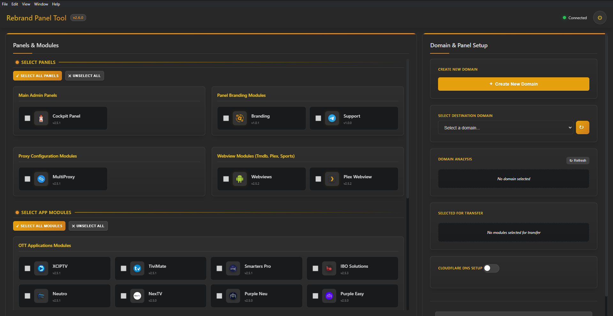

# Rebrands Tool

[](https://github.com/cyb3rgh05t/rebrand-tool/actions/workflows/build.yml)
[](https://opensource.org/licenses/MIT)
[](https://www.electronjs.org/)

An Electron-based desktop application for streamlined management of IPTV app panels, domain creation, and file deployment. This tool helps you efficiently transfer application modules and panels to your server while automating DNS record creation via Cloudflare.



## ✨ Features

- **Domain Management**

  - Create new Virtualmin domains with custom PHP configuration
  - Automated domain setup with detailed logging
  - Easy subdomain selection from existing domains

- **Multi-Module Transfer**

  - Transfer multiple app modules and panels simultaneously
  - Comprehensive module selection for OTT, VOD, VPN, and store applications
  - Batch selection/deselection tools for efficient workflow

- **DNS Integration**

  - One-click DNS record creation via Cloudflare API
  - Automatic subdomain configuration
  - Supports both IPv4 and IPv6 record creation

- **Server Integration**
  - Secure SFTP file transfer to remote servers
  - Real-time connection status monitoring
  - Detailed transfer logs and status reporting

## 🚀 Installation

### Prerequisites

- Node.js 16.x or later
- Electron 25.0.0
- A server with SSH/SFTP access
- Virtualmin control panel (for domain management features)
- Cloudflare account (for DNS features)

### Installation Steps

1. Clone the repository:

   ```bash
   git clone https://github.com/cyb3rgh05t/rebrand-tool.git
   cd rebrand-tool
   ```

2. Install dependencies:

   ```bash
   npm install
   ```

3. Create a configuration file:

   ```bash
   cp .env.example .env
   ```

4. Edit the `.env` file with your server and Cloudflare credentials.

5. Start the application:
   ```bash
   npm start
   ```

## 🔧 Configuration

The application uses an `.env` file for configuration. Here are the key settings:

### Server Connection

```
STREAMNET_SERVER_HOST="your_server_ip"
STREAMNET_SERVER_USER="your_server_username"
STREAMNET_SERVER_PASSWORD="your_server_password"
STREAMNET_SERVER_PORT="22"
```

### Cloudflare API

```
CLOUDFLARE_API_TOKEN="your_cloudflare_api_token"
CLOUDFLARE_EMAIL="your_cloudflare_email"
CLOUDFLARE_API_KEY="your_cloudflare_api_key"
CLOUDFLARE_ZONE_ID="your_cloudflare_zone_id"
CLOUDFLARE_ROOT_DOMAIN="your_domain.com"
CLOUDFLARE_IPV4_ADDRESS="your_server_ipv4"
CLOUDFLARE_IPV6_ADDRESS="your_server_ipv6"
```

### Paths and Virtualmin

```
SOURCE_BASE_PATH="/home/"
DESTINATION_BASE_PATH="/home/"
VIRTUALMIN_PORT="10000"
```

See the `.env.example` file for all available configuration options.

## 💻 Usage

### Domain Management

1. Click "Create New Domain" to open the domain creation dialog
2. Enter a subdomain name and description
3. Select PHP configuration options
4. Click "Create Subdomain" to set up the domain

### Module Transfer

1. Select the destination domain from the dropdown
2. Choose modules and panels to transfer
3. Optionally enable DNS record creation
4. Click "Transfer Files" to begin the operation

### DNS Setup

1. Enable the DNS toggle in the destination panel
2. Enter the subdomain for DNS record creation
3. Confirm the domain preview shows the correct FQDN
4. Use "Create DNS Records Only" if you only need DNS configuration

## 🔨 Building the Application

To build distributable versions of the application:

```bash
# Build for all platforms
npm run build

# Build for specific platforms
npm run build:win   # Windows
npm run build:mac   # macOS
npm run build:linux # Linux
```

The built applications will be available in the `dist` directory.

## 🌐 Supported Applications

The tool supports transferring various application panels and modules:

### OTT Applications

- XCIPTV
- TiviMate
- Smarters Pro
- IBO
- Neutro
- Purple Neu
- Purple Easy
- Sparkle
- 1Stream
- 9Xtream
- more will be added .....

### VOD Applications

- FlixVision
- SmartTube
- Stremio
- more will be added .....

### VPN Applications

- ORVPN
- IPVanish
- PIA
- more will be added .....

### STORE Applications

- Downloader
- SH9 Store
- more will be added .....

## 🤝 Contributing

Contributions are welcome! Please feel free to submit a Pull Request.

1. Fork the repository
2. Create your feature branch (`git checkout -b feature/amazing-feature`)
3. Commit your changes (`git commit -m 'Add some amazing feature'`)
4. Push to the branch (`git push origin feature/amazing-feature`)
5. Open a Pull Request

## 📄 License

This project is licensed under the MIT License - see the [LICENSE](LICENSE) file for details.

## 🔗 Links

- [Electron Documentation](https://www.electronjs.org/docs)
- [Cloudflare API Documentation](https://developers.cloudflare.com/api/)
- [Virtualmin API Documentation](https://www.virtualmin.com/documentation/developer/http-api/)

---

Created with ❤️ by [cyb3rgh05t](https://github.com/cyb3rgh05t) © 2025
